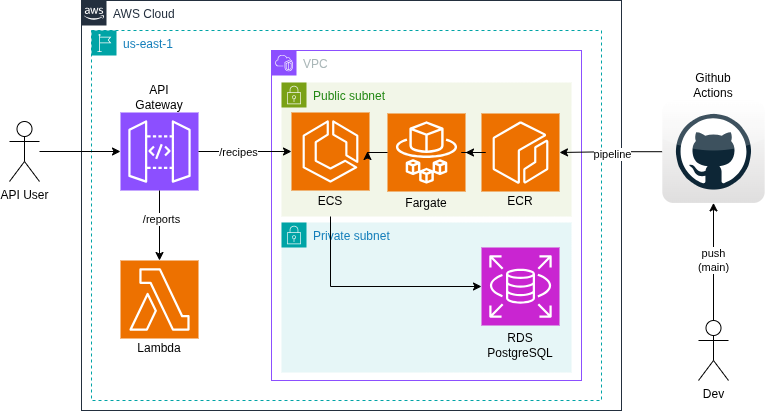
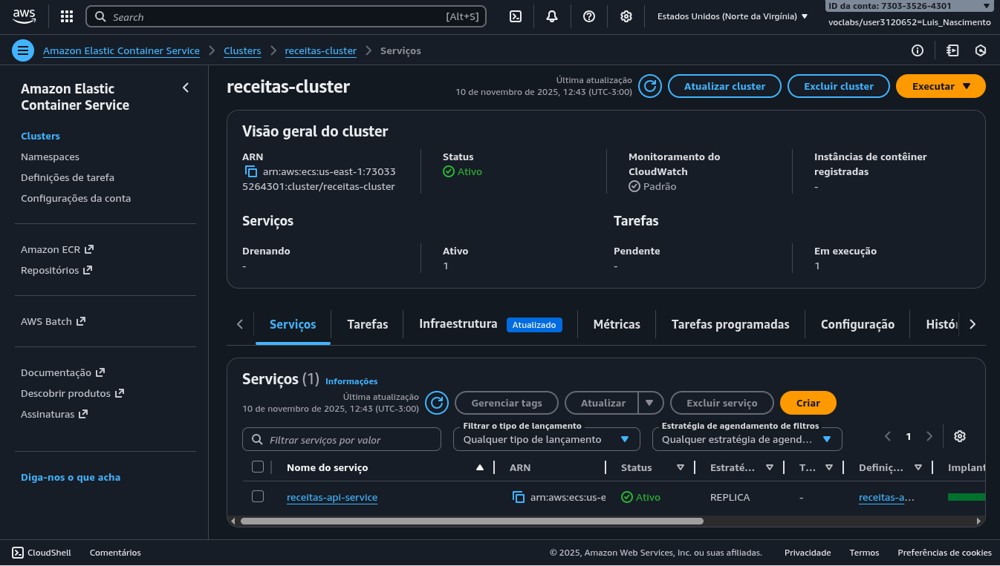
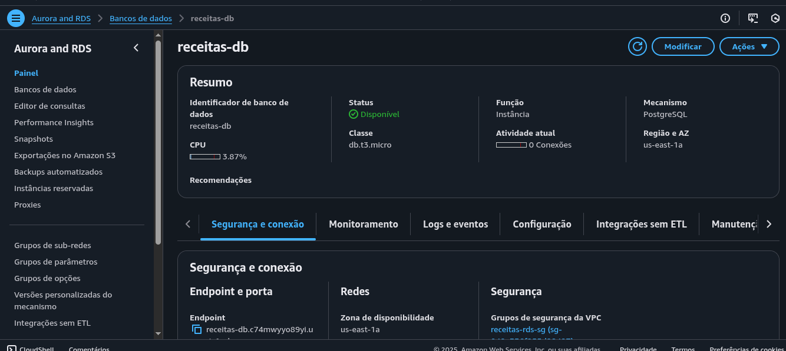
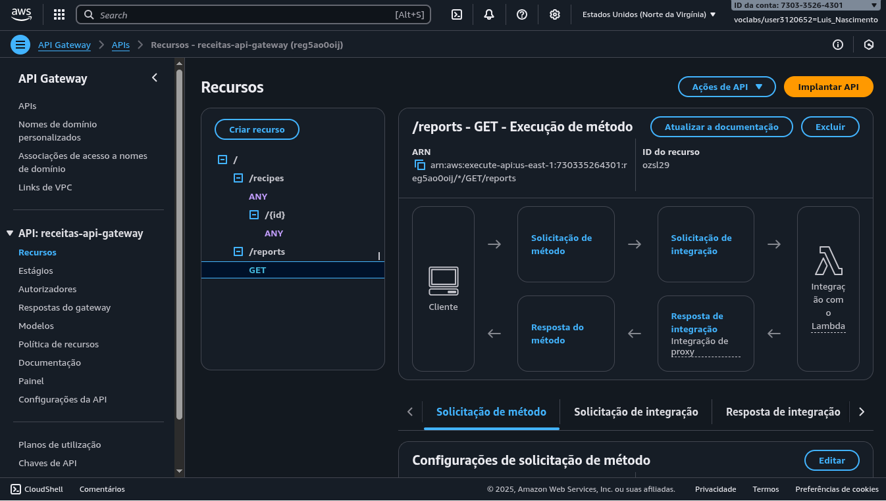
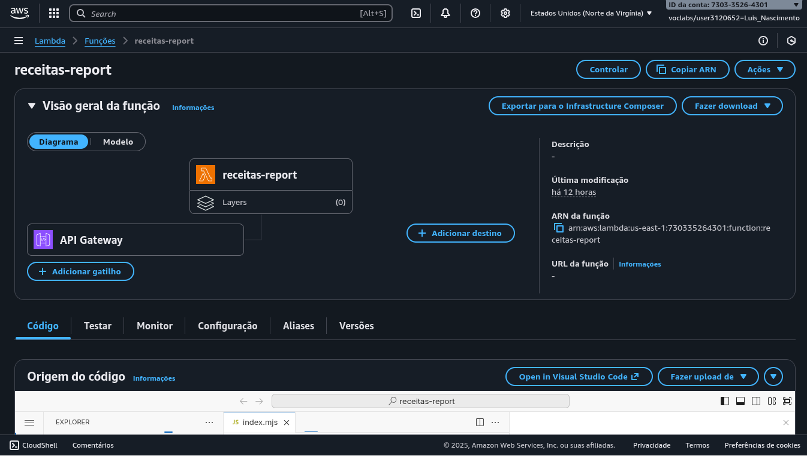
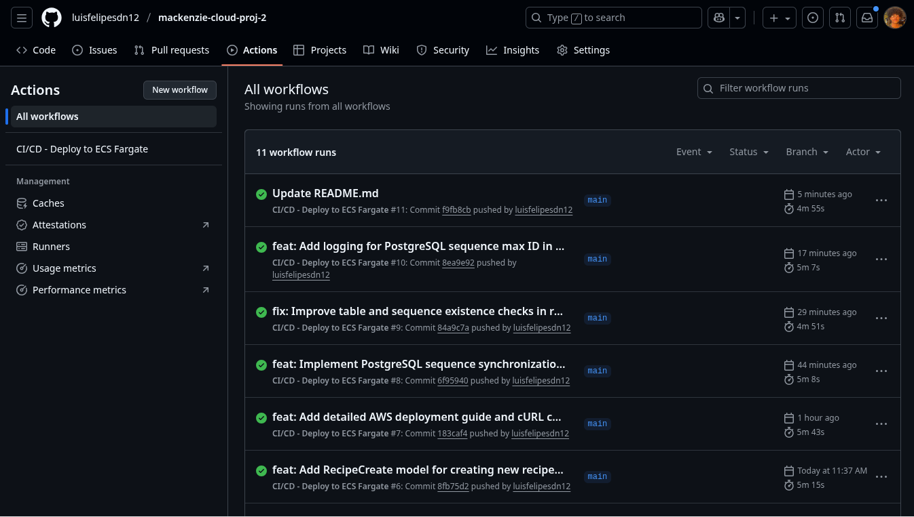
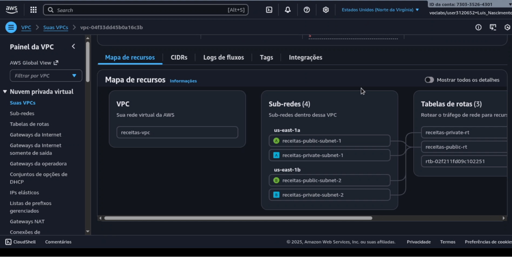

# Relatório do Projeto Integrador – Cloud Developing 2025/2

**Título do Projeto:** API REST para Gerenciamento de Receitas com Deploy na AWS

**Grupo:**
- 10420572 - Luis Felipe Santos do Nascimento - Desenvolvimento da API, Docker
- 10420317 - Arthur Jones Bicalho dos Santos - Função Lambda
- 10420357 - Alex Cruz de Santana - Documentação

**Instituição:** Universidade Presbiteriana Mackenzie
**Período:** 2025/2

## 1. Introdução

Este documento apresenta o relatório técnico do Projeto Integrador desenvolvido para a disciplina de Cloud Developing. O projeto consiste na implementação de uma API REST para gerenciamento de receitas culinárias, utilizando serviços da AWS (Amazon Web Services) para hospedagem e integração.

O objetivo principal foi demonstrar o conhecimento prático em desenvolvimento de APIs, containerização com Docker, e deploy de aplicações em nuvem utilizando serviços como ECS Fargate, RDS, Lambda, API Gateway e CI/CD com GitHub Actions.

## 2. Visão Geral do Projeto

### 2.1 Objetivos

O projeto visa implementar uma solução completa de CRUD (Create, Read, Update, Delete) para gerenciamento de receitas, demonstrando:

- Desenvolvimento de API REST com FastAPI
- Containerização com Docker
- Integração com banco de dados PostgreSQL (RDS)
- Deploy automatizado com CI/CD
- Integração entre serviços AWS (Lambda, API Gateway, ECS)

### 2.2 Escopo

A aplicação permite:

- **Criar** novas receitas com informações detalhadas (ingredientes, instruções, tempos de preparo, etc.)
- **Listar** todas as receitas cadastradas
- **Buscar** receitas específicas por ID
- **Atualizar** informações de receitas existentes
- **Deletar** receitas

Além disso, uma função Lambda consome a API para gerar estatísticas sobre as receitas (tempo médio de cozimento, categorização por duração, etc.), demonstrando integração entre serviços AWS.

### 2.3 Justificativa da Escolha do Domínio

O domínio de receitas culinárias foi escolhido por ser intuitivo e permitir demonstrar operações CRUD completas de forma clara. Além disso, oferece a possibilidade de trabalhar com diferentes tipos de dados (texto, números, relacionamentos) de forma simples e compreensível.

## 3. Arquitetura da Solução

### 3.1 Diagrama de Arquitetura



### 3.2 Componentes da Arquitetura

A arquitetura da solução é composta pelos seguintes componentes:

#### 3.2.1 Backend - ECS Fargate

- **Serviço:** Amazon ECS Fargate
- **Descrição:** API REST FastAPI containerizada, rodando em containers serverless
- **Responsabilidade:** Processar requisições HTTP e gerenciar operações CRUD no banco de dados
- **Porta:** 80
- **Tecnologia:** Python 3.9, FastAPI, SQLModel




#### 3.2.2 Banco de Dados - Amazon RDS

- **Serviço:** Amazon RDS (PostgreSQL)
- **Descrição:** Banco de dados PostgreSQL em subnet privada, acessível apenas pela VPC
- **Responsabilidade:** Armazenar dados das receitas de forma persistente
- **Configuração:** Instância db.t3.micro, 20GB de armazenamento
- **Segurança:** Acesso restrito apenas via Security Group do ECS



#### 3.2.3 Gateway - Amazon API Gateway

- **Serviço:** Amazon API Gateway (REST API)
- **Descrição:** Rotas CRUD (`/recipes/*`) → ECS Fargate · `/reports` → Lambda
- **Responsabilidade:** Gerenciar requisições HTTP e rotear para os serviços apropriados
- **Tipo:** Regional



#### 3.2.4 Função Serverless - AWS Lambda

- **Serviço:** AWS Lambda
- **Descrição:** Consome a API via API Gateway, processa dados e retorna estatísticas JSON
- **Responsabilidade:** Gerar relatórios e estatísticas sobre as receitas
- **Runtime:** Node.js 20.x
- **Endpoint:** `/reports`



#### 3.2.5 CI/CD - GitHub Actions

- **Serviço:** GitHub Actions
- **Descrição:** Automatiza build da imagem Docker, push para ECR e deploy no ECS
- **Responsabilidade:** Garantir deploy automatizado a cada push no branch main
- **Trigger:** Push para branch `main` ou execução manual



### 3.3 Fluxo de Dados

1. **Requisição do Cliente:** Cliente faz requisição HTTP para o API Gateway
2. **Roteamento:** API Gateway roteia a requisição:
   - Rotas `/recipes/*` → ECS Fargate (API REST)
   - Rota `/reports` → Lambda Function
3. **Processamento:**
   - **ECS Fargate:** Processa requisição, consulta/atualiza RDS, retorna resposta
   - **Lambda:** Busca dados da API via API Gateway, processa estatísticas, retorna JSON
4. **Resposta:** API Gateway retorna resposta ao cliente

### 3.4 Segurança e Rede

#### 3.4.1 VPC e Subnets

- **VPC:** `receitas-vpc` (CIDR: 10.0.0.0/16)
- **Subnets Públicas:** Para ECS Fargate (com acesso à internet)
- **Subnets Privadas:** Para RDS (sem acesso direto à internet)
- **Internet Gateway:** Conecta subnets públicas à internet



#### 3.4.2 Security Groups

- **ECS Security Group:** Permite tráfego HTTP (porta 80) de qualquer origem
- **RDS Security Group:** Permite tráfego PostgreSQL (porta 5432) apenas do ECS Security Group

---

## 4. Tecnologias Utilizadas

### 4.1 Backend

- **FastAPI:** Framework web moderno e rápido para Python
- **SQLModel:** ORM baseado em Pydantic e SQLAlchemy
- **Python 3.9:** Linguagem de programação

### 4.2 Banco de Dados

- **PostgreSQL:** Sistema de gerenciamento de banco de dados relacional
- **Amazon RDS:** Serviço gerenciado de banco de dados

### 4.3 Containerização

- **Docker:** Plataforma de containerização
- **Docker Compose:** Orquestração de containers (desenvolvimento local)

### 4.4 Cloud - AWS

- **ECS Fargate:** Serviço de containers serverless
- **ECR:** Registry de imagens Docker
- **RDS:** Banco de dados gerenciado
- **Lambda:** Computação serverless
- **API Gateway:** Gerenciamento de APIs
- **VPC:** Rede virtual privada
- **CloudWatch:** Monitoramento e logs

### 4.5 CI/CD

- **GitHub Actions:** Automação de workflows
- **AWS CLI:** Interface de linha de comando da AWS

---

## 5. Desenvolvimento da API

### 5.1 Modelo de Dados

O modelo de dados consiste em uma única tabela `recipe` com os seguintes campos:

```sql
CREATE TABLE recipe (
    id INTEGER PRIMARY KEY,
    name VARCHAR NOT NULL,
    description VARCHAR,
    ingredients TEXT NOT NULL,
    instructions TEXT NOT NULL,
    prep_time_minutes INTEGER,
    cook_time_minutes INTEGER,
    servings INTEGER
);
```

**Campos:**
- `id`: Identificador único (chave primária, auto-incremento)
- `name`: Nome da receita (obrigatório)
- `description`: Descrição breve da receita (opcional)
- `ingredients`: Lista de ingredientes (obrigatório)
- `instructions`: Instruções de preparo (obrigatório)
- `prep_time_minutes`: Tempo de preparo em minutos (opcional)
- `cook_time_minutes`: Tempo de cozimento em minutos (opcional)
- `servings`: Número de porções (opcional)

### 5.2 Endpoints da API

#### 5.2.1 Endpoint Raiz

- **Método:** GET
- **Endpoint:** `/`
- **Descrição:** Retorna informações sobre a API e lista de endpoints disponíveis

#### 5.2.2 CRUD de Receitas

| Método | Endpoint              | Descrição                          |
|--------|-----------------------|------------------------------------|
| GET    | `/recipes/`           | Lista todas as receitas            |
| GET    | `/recipes/{id}`       | Busca receita por ID               |
| POST   | `/recipes/`           | Cria nova receita                  |
| PUT    | `/recipes/{id}`       | Atualiza receita existente         |
| DELETE | `/recipes/{id}`       | Remove receita                     |

#### 5.2.3 Endpoint de Relatórios

- **Método:** GET
- **Endpoint:** `/reports`
- **Descrição:** Retorna estatísticas sobre as receitas (via Lambda)

### 5.3 Exemplos de Uso

#### 5.3.1 Criar Receita

```bash
curl -X POST "http://localhost/recipes/" \
  -H "Content-Type: application/json" \
  -d '{
    "name": "Brigadeiro",
    "description": "Doce brasileiro",
    "ingredients": "Leite condensado, chocolate",
    "instructions": "Misture e cozinhe",
    "prep_time_minutes": 5,
    "cook_time_minutes": 15,
    "servings": 20
  }'
```


#### 5.3.2 Listar Receitas

```bash
curl "http://localhost/recipes/"
```


#### 5.3.3 Buscar Receita por ID

```bash
curl "http://localhost/recipes/1"
```

#### 5.3.4 Atualizar Receita

```bash
curl -X PUT "http://localhost/recipes/1" \
  -H "Content-Type: application/json" \
  -d '{
    "name": "Brigadeiro Gourmet",
    "servings": 25
  }'
```

#### 5.3.5 Deletar Receita

```bash
curl -X DELETE "http://localhost/recipes/1"
```

### 5.4 Funcionalidades Implementadas

#### 5.4.1 Criação Automática do Banco de Dados

A aplicação verifica automaticamente se o banco de dados existe e o cria caso necessário, facilitando o deploy inicial.

#### 5.4.2 Inicialização de Dados

A aplicação verifica se a tabela está vazia e, caso esteja, executa o script `initialize.sql` para popular dados iniciais.

#### 5.4.3 Paginação

O endpoint de listagem suporta paginação através dos parâmetros `offset` e `limit`:

```bash
curl "http://localhost/recipes/?offset=0&limit=10"
```

---

## 6. Função Lambda

### 6.1 Objetivo

A função Lambda foi desenvolvida para consumir a API via API Gateway e gerar estatísticas sobre as receitas cadastradas.

### 6.2 Funcionalidades

A função Lambda calcula as seguintes estatísticas:

- **Total de receitas:** Quantidade total de receitas cadastradas
- **Categorização por tempo de cozimento:**
  - Receitas rápidas (≤ 10 min)
  - Receitas médias (> 10 min e ≤ 15 min)
  - Receitas longas (> 15 min)
- **Tempo médio de cozimento:** Média aritmética do tempo de cozimento
- **Tempo médio de preparo:** Média aritmética do tempo de preparo
- **Tempo médio total:** Soma dos tempos médios de preparo e cozimento

### 6.3 Configuração

- **Runtime:** Node.js 20.x
- **Handler:** `lambda.handler`
- **Variável de Ambiente:** `API_GATEWAY_URL` (URL base do API Gateway)
- **Timeout:** Padrão (3 segundos)
- **Memória:** Padrão (128 MB)

### 6.4 Exemplo de Resposta

```json
{
  "total_receitas": 5,
  "tempo_de_cozimento": {
    "receitas rápidas (<= 10 min)": 2,
    "receitas médias (> 10 min e <= 15 min)": 2,
    "receitas longas (> 15 min)": 1
  },
  "tempo_medio_cozimento_minutos": 12,
  "tempo_medio_preparo_minutos": 10,
  "tempo_medio_total_minutos": 22,
  "tempo_medio_cozimento": "Tempo médio de cozimento em nossas receitas: 12 minutos",
  "tempo_medio_preparo": "Tempo médio de preparo em nossas receitas: 10 minutos"
}
```

### 6.5 Tratamento de Erros

A função Lambda trata os seguintes casos:

- **API não disponível:** Retorna erro 500 com mensagem descritiva
- **Nenhuma receita encontrada:** Retorna resposta vazia com status 200
- **Erros de processamento:** Retorna erro 500 com detalhes do erro

---

## 7. Containerização com Docker

### 7.1 Dockerfile

O Dockerfile foi configurado para criar uma imagem otimizada da aplicação:

```dockerfile
FROM python:3.9

WORKDIR /code

COPY ./requirements.txt /code/requirements.txt

RUN pip install --no-cache-dir --upgrade -r /code/requirements.txt

COPY . /code/app

CMD ["uvicorn", "app.main:app", "--host", "0.0.0.0", "--port", "80"]
```

**Características:**
- Base: Python 3.9
- Instalação de dependências via `requirements.txt`
- Exposição da aplicação na porta 80
- Uvicorn como servidor ASGI

### 7.2 Docker Compose (Desenvolvimento Local)

Para desenvolvimento local, foi criado um arquivo `docker-compose.yml` que orquestra a aplicação e o banco de dados PostgreSQL:

### 7.3 Build e Teste Local

```bash
cd src
docker compose up --build
```

---

## 8. Deploy na AWS

### 8.1 Infraestrutura como Código

A infraestrutura foi criada manualmente seguindo as melhores práticas da AWS. Os principais componentes criados foram:

1. **VPC e Configuração de Rede**
   - VPC com CIDR 10.0.0.0/16
   - Subnets públicas e privadas
   - Internet Gateway
   - Route Tables

2. **RDS PostgreSQL**
   - Instância db.t3.micro
   - 20GB de armazenamento
   - Subnet privada
   - Security Group restritivo

3. **ECR Repository**
   - Repositório privado para armazenar imagens Docker

4. **ECS Cluster e Service**
   - Cluster Fargate
   - Task Definition com variáveis de ambiente
   - Service com auto-restart

5. **Lambda Function**
   - Função Node.js 20.x
   - Configurada para consumir API Gateway

6. **API Gateway**
   - REST API Regional
   - Recursos e métodos configurados
   - Integração com ECS e Lambda

### 8.2 Variáveis de Ambiente

As seguintes variáveis de ambiente foram configuradas na Task Definition do ECS:

| Variável      | Descrição                    | Exemplo                          |
|---------------|------------------------------|----------------------------------|
| `DB_HOST`     | Host do banco de dados       | `receitas-db.xxx.rds.amazonaws.com` |
| `DB_PORT`     | Porta do banco               | `5432`                           |
| `DB_USER`     | Usuário do banco             | `admin`                          |
| `DB_PASSWORD` | Senha do banco               | `senha_segura`                   |
| `DB_NAME`     | Nome do banco de dados       | `receitas`                       |

### 8.3 Processo de Deploy Manual

O processo de deploy manual envolve os seguintes passos:

1. Build da imagem Docker localmente
2. Push da imagem para o ECR
3. Atualização da Task Definition
4. Atualização do ECS Service

---

## 9. CI/CD com GitHub Actions

### 9.1 Workflow de Deploy

O workflow do GitHub Actions automatiza o processo de deploy sempre que há push para o branch `main`:

**Etapas do Workflow:**

1. **Checkout do código:** Baixa o código do repositório
2. **Configuração de credenciais AWS:** Configura credenciais usando secrets do GitHub
3. **Login no ECR:** Autentica no Amazon ECR
4. **Build e Push da imagem:** Constrói a imagem Docker e faz push para o ECR
5. **Download da Task Definition:** Baixa a task definition atual do ECS
6. **Atualização da Task Definition:** Atualiza a imagem na task definition
7. **Deploy no ECS:** Faz deploy da nova revisão da task definition no ECS Service

### 9.2 Secrets Configurados

Os seguintes secrets foram configurados no GitHub:

- `AWS_ACCESS_KEY_ID`
- `AWS_SECRET_ACCESS_KEY`
- `AWS_SESSION_TOKEN` (para AWS Academy Learner Lab)
- `AWS_REGION`
- `ECR_REPOSITORY`
- `ECS_CLUSTER`
- `ECS_SERVICE`
- `ECS_TASK_DEFINITION`

## 10. Conclusão

Este projeto demonstrou com sucesso a implementação de uma API REST completa com deploy na AWS, utilizando diversos serviços da plataforma. Os objetivos principais foram alcançados:

✅ **API REST funcional** com operações CRUD completas  
✅ **Containerização** com Docker e deploy no ECS Fargate  
✅ **Banco de dados** PostgreSQL gerenciado no RDS  
✅ **Integração serverless** com Lambda para geração de relatórios  
✅ **API Gateway** configurado e funcionando  
✅ **CI/CD automatizado** com GitHub Actions  

### 10.1 Aprendizados

- Configuração de infraestrutura na AWS (VPC, Security Groups, RDS, ECS)
- Desenvolvimento de APIs REST com FastAPI
- Containerização e orquestração com Docker
- Integração entre serviços AWS
- Automação de deploy com CI/CD
- Boas práticas de segurança em nuvem

## 11. Referências

- [FastAPI Documentation](https://fastapi.tiangolo.com/)
- [AWS ECS Documentation](https://docs.aws.amazon.com/ecs/)
- [AWS RDS Documentation](https://docs.aws.amazon.com/rds/)
- [AWS API Gateway Documentation](https://docs.aws.amazon.com/apigateway/)
- [AWS Lambda Documentation](https://docs.aws.amazon.com/lambda/)
- [GitHub Actions Documentation](https://docs.github.com/en/actions)
- [Docker Documentation](https://docs.docker.com/)
- [SQLModel Documentation](https://sqlmodel.tiangolo.com/)
